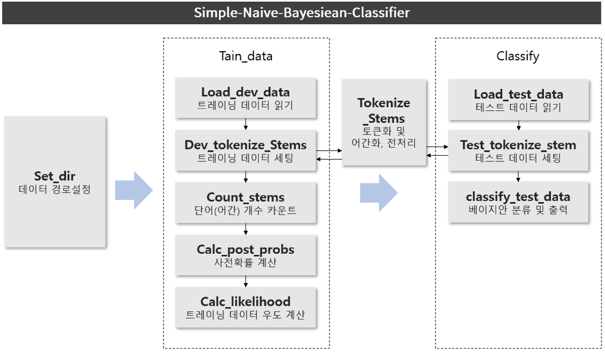

# Simple-Naive-Bayesian-Classifier
## 개요
나이브 베이즈 기법을 이용하여 글의 주제를 분류하는 프로그램입니다.

## 사용법
### 트레이닝 데이터
트레이닝 데이터는 텍스트 파일이어야 하며 /주제/이름.txt 형식이어야 합니다.
예를 들어, 주제가 jobs인 원문1, 원문2, 주제가 interest인 원문3, 원문4가 있다면
/jobs/원문1.txt , /jobs/원문2.txt, /interest/원문3.txt, /interest/원문4.txt 경로로 정리됩니다.

### 테스트 데이터
테스트 데이터는 주제를 분류할 대상입니다. 원문 하나당 하나의 txt파일 형식이어야 합니다.

### 트레이닝 및 테스트 데이터 분류
클래스를 정의합니다.
> NBC = NaiveBayesianClassifier()

트레이닝 데이터와 테스트 데이터의 경로를 지정합니다.
> NBC.set_dir("./dev/", "./test/")

주어진 트레이닝 데이터를 기반으로 트레이닝합니다.
> NBC.train_data()

주어진 테스트 데이터를 분류하고 결과를 표시합니다.
> NBC.classify()

## 구조

## 사용된 기술
- Stemming 의 Porter2 Stemmer : 어간화
- nltk의 TreeBankWordTokenizer, sent_tokenize : 토큰화
- nltk의 stopwords : 불용어 제외 처리

## Credit
- https://ratsgo.github.io/machine%20learning/2017/05/18/naive/
- Think Bayes(앨런 B. 다우니 지음, 권정민 옮김, 한빛미디어 펴냄)
- Speech and Language Processing(2nd ver)
